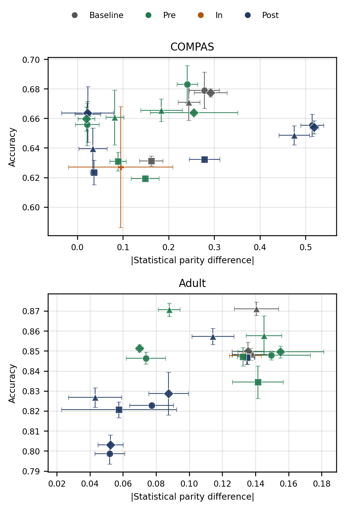
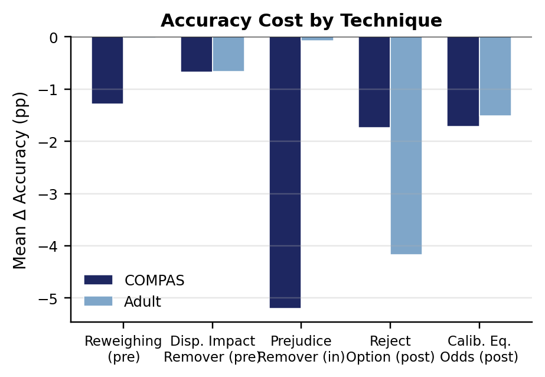
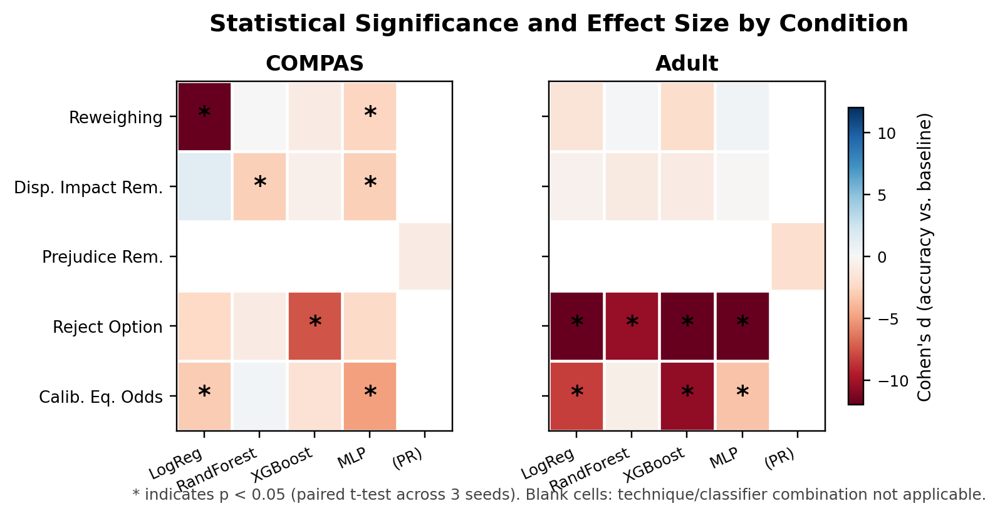

# REBALANCE

**Quantifying the Racial Bias Accuracy-Fairness Trade-off in Machine Learning Across Criminal Justice and Employment**

Joshua Oghosasehe Ekogiawe · Department of Computing · Ulster University

## Summary

Debiasing a machine learning model to reduce racial disparity is rarely free — it usually costs some predictive accuracy. Regulation such as the EU AI Act requires "demonstrable non-discrimination" in high-risk systems but gives no quantitative guidance on what that accuracy cost should be, or whether it is the same across different domains.

REBALANCE measures this trade-off empirically and directly, using the **same protected attribute (Black vs. White)** held constant across two structurally different, real-world regulated domains — **criminal justice** (COMPAS recidivism prediction) and **employment** (Adult Income) — so that any difference in trade-off severity can be attributed to the domain itself, not to a change in what "fairness" is being measured.

## Experimental design

- **2 datasets**: COMPAS (5,278 records) and Adult Income (43,800 records)
- **5 debiasing techniques** from IBM AI Fairness 360, covering all three intervention categories:
  - Pre-processing: Reweighing, Disparate Impact Remover
  - In-processing: Prejudice Remover
  - Post-processing: Calibrated Equalised Odds, Reject Option Classification
- **4 classifiers**: Logistic Regression, Random Forest, XGBoost, Multi-Layer Perceptron
- **3 random seeds** per condition (42, 7, 123)
- **42 conditions × 3 seeds = 126 experimental runs** in total

Every condition is evaluated on accuracy, F1-score, AUC-ROC, Matthews Correlation Coefficient, statistical parity difference, average odds difference, equal opportunity difference, and disparate impact, against a matched baseline (same dataset, same classifier, same hyperparameters, no debiasing applied).

## Key findings

Mean change in accuracy (Δaccuracy) and fairness (Δ|SPD|, higher = fairer), relative to the matched baseline, averaged across classifiers:

| Domain | Technique | Δ Accuracy | Δ \|SPD\| |
|---|---|---:|---:|
| COMPAS | Reweighing | −0.013 | +0.191 |
| COMPAS | Disparate Impact Remover | −0.007 | +0.037 |
| COMPAS | Prejudice Remover | −0.052 | +0.183 |
| COMPAS | Reject Option | −0.017 | +0.215 |
| COMPAS | Calibrated Equalised Odds | −0.017 | **−0.203** |
| Adult Income | Reweighing | −0.000 | +0.046 |
| Adult Income | Disparate Impact Remover | −0.007 | −0.011 |
| Adult Income | Prejudice Remover | −0.001 | +0.003 |
| Adult Income | Reject Option | −0.042 | +0.086 |
| Adult Income | Calibrated Equalised Odds | −0.015 | +0.034 |

- **Debiasing is not free**: 13 of 33 technique–classifier comparisons reached statistical significance (p < 0.05, paired t-test across 3 seeds).
- **No technique is universally cheapest**: Reweighing is the most cost-effective technique on COMPAS; Reject Option is most cost-effective on Adult Income.
- **The same technique can help or hurt depending on domain**: Calibrated Equalised Odds *improves* fairness on Adult Income (+0.034) but actively *worsens* it on COMPAS (−0.203), because it optimises a false-negative-rate calibration criterion that interacts differently with each domain's baseline disparity.
- **Ranking stability is itself domain-dependent**: on Adult Income, Reweighing is the best technique across all four classifier families (a stable ranking). On COMPAS, the best technique changes with the classifier (an unstable ranking).

See `docs/REBALANCE_Research_Paper.docx` and `docs/REBALANCE_Extended_Supporting_Document.docx` for the full analysis, statistical testing, and discussion.

## Repository structure

```
.
├── src/
│   ├── download_data.py            # Fetches COMPAS and Adult Income into src/data/
│   └── rebalance_pipeline.py       # Full experimental pipeline (checkpointed, resumable)
├── results/
│   ├── results_full_raw.csv        # All 126 individual runs
│   ├── results_full_aggregated.csv # Mean ± SD per condition (42 rows)
│   └── results_pilot.csv           # Earlier single-seed pilot run
├── figures/
│   ├── fig01_fairness_impossibility_theorem.png
│   ├── fig02_aif360_debiasing_taxonomy.png
│   ├── fig03_research_development_lifecycle.png
│   ├── fig04_full_factorial_experimental_design.png
│   ├── fig05_experimental_measurement_pipeline.png
│   ├── fig06_mean_accuracy_cost_by_technique.png
│   ├── fig07_mean_fairness_improvement_by_technique.png
│   ├── fig08_accuracy_fairness_pareto_operating_points.png
│   ├── fig09_cost_effectiveness_by_classifier_family.png
│   ├── fig10_statistical_significance_effect_size.png
│   └── fig11_software_architecture.png
├── docs/
│   ├── REBALANCE_Research_Paper.docx
│   ├── REBALANCE_Extended_Supporting_Document.docx
│   └── REBALANCE_Presentation.pptx
├── requirements.txt
└── README.md
```

## Reproducing the results

```bash
pip install -r requirements.txt
```

Download the two source datasets (ProPublica COMPAS and UCI Adult Income) into `src/data/`:

```bash
cd src
python download_data.py
```

Then run the pipeline. It processes one dataset/seed combination per invocation and checkpoints to CSV, so it can be safely resumed if interrupted:

```bash
python rebalance_pipeline.py --dataset compas --seed 42
python rebalance_pipeline.py --dataset compas --seed 7
python rebalance_pipeline.py --dataset compas --seed 123
python rebalance_pipeline.py --dataset adult  --seed 42
python rebalance_pipeline.py --dataset adult  --seed 7
python rebalance_pipeline.py --dataset adult  --seed 123
python rebalance_pipeline.py --aggregate
```

Each checkpoint appends to `results_full_raw.csv`; `--aggregate` produces `results_full_aggregated.csv` (mean ± SD per condition). Re-running a checkpoint that has already completed is a no-op.

You may see harmless startup warnings about `tensorflow` and `fairlearn` not being installed — these are optional AIF360 extras needed only for Adversarial Debiasing and Exponentiated Gradient Reduction, neither of which is used by this study.

## Results figures







## Scope and limitations

This is an MSc-scoped study, deliberately calibrated to what one researcher can execute and analyse rigorously: 5 of AIF360's 9 debiasing techniques, fixed (not per-condition-tuned) hyperparameters, 3 seeds, and two domains. These are stated explicitly in the full report rather than hidden, and none of them affect the core finding that the accuracy-fairness trade-off is technique- and domain-specific rather than a single fixed price.

## License

MIT — see `LICENSE`.

## Citation

If you reference this work, please cite:

> J. O. Ekogiawe, "REBALANCE: Quantifying the Racial Bias Accuracy-Fairness Trade-off in Machine Learning Across Criminal Justice and Employment," MSc research project, Department of Computing, Ulster University, 2026.
